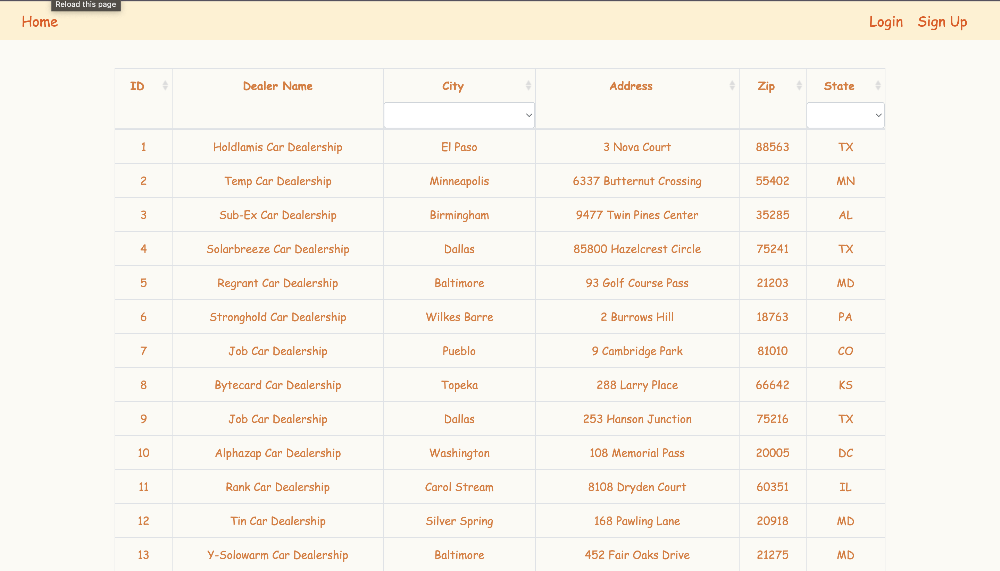
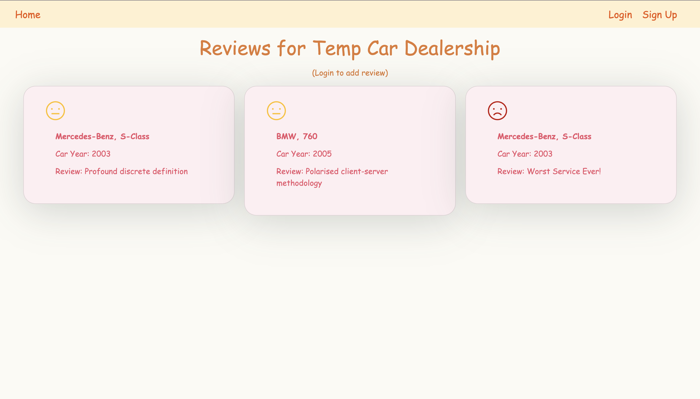
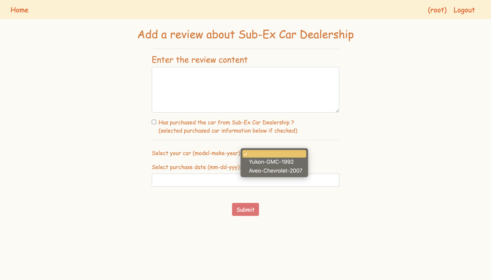
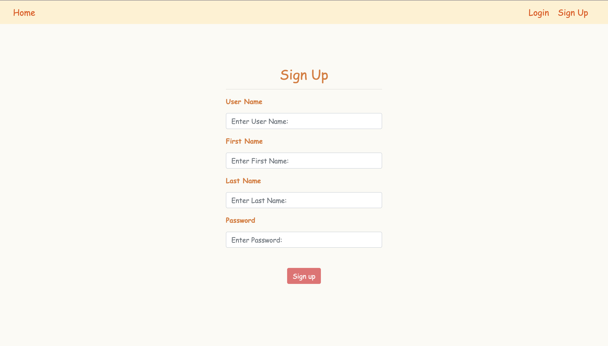
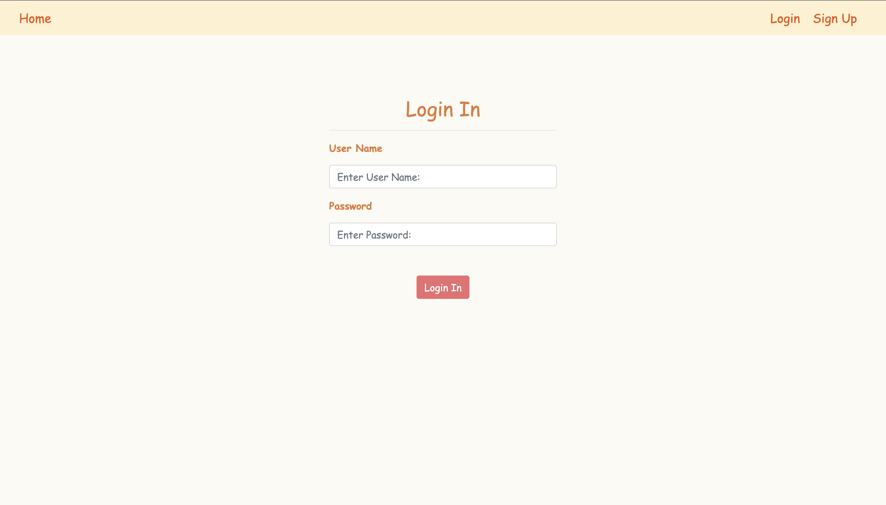

## Car Dealership Review Platform
In this project, a car dealership review platform is developed. The platform allows new and existing customers to look up information of different car dealership branches. Customers are able to create an account and add their review for any of the branches.

### Languages/Frameworks

- Python
- HTML/CSS
- JavaScript
- Django
- NodeJS
- Bootstrap
- SQLite
- IBM Services 
  - IBM Cloudant databases
  - IBM Cloud Function
  - IBM Cloud Foundry
  - IBM Natural Language Understanding

### Current Features
1. Display car dealership information and support filtering the list of dealerships by state.
2. Platform member registration and login.
3. A review submission section that allows registered users to add reviews based on the make and model of the car they purchased from the dealership
4. Review sentiment analysis which classifies the sentiment of a review as positive, negative or neutral.
5. Admin user account of the application that support easy modification of data stored in the databases.

### Application Link (deployed on IBM Cloud Foundry)
https://jc-888.eu-gb.mybluemix.net/djangoapp/

### User Interface
| Dealership List                             | Dealership Review                              | Add Review
|------------------------------------------------|-----------------------------------------|-----------------------------------------|
|   |  |  |

| User Registration Page                    | User Login Page                     |
|-------------------------------------------|-------------------------------------|
|  |  |

### Notice
This project is the capstone project of [Full Stack Cloud Development Courses](https://www.coursera.org/learn/ibm-cloud-native-full-stack-development-capstone) offered by IBM Skills Network on Coursera.